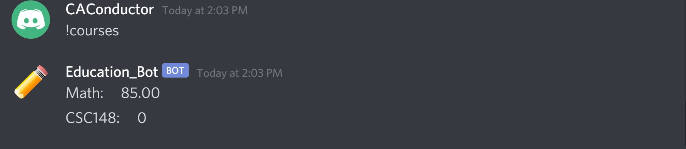
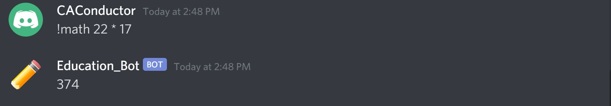
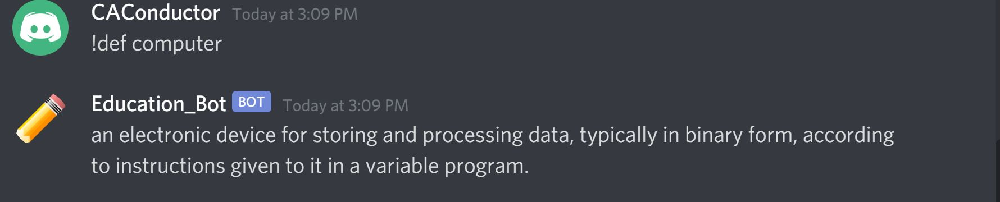
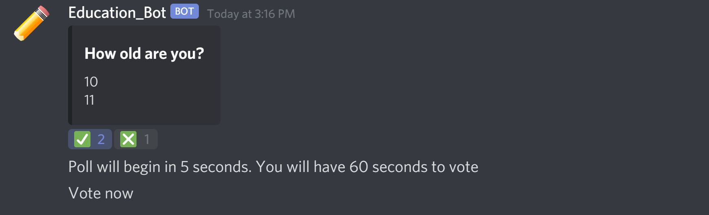
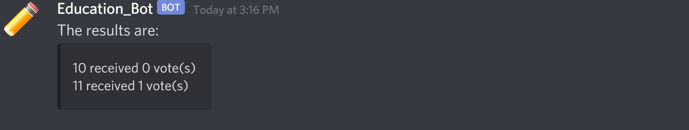
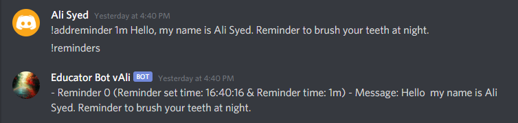
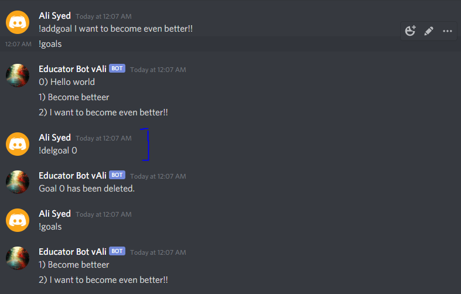
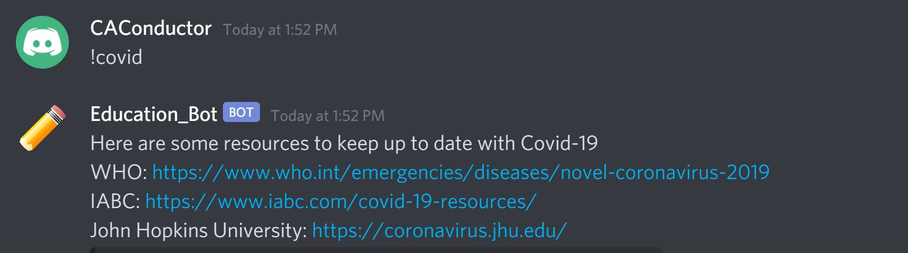

# Education_Bot 

A bot on discord to make online education more engaging, interactive, motivating and convenient for instructors and students. With numerous intuitive features, the Education Bot will make online learning a success.

Some of the challenges we addressed with our Education_Bot features include:
* Lack of Motivation
** Goal Feature, Reminder Feature

# Setup
All you need to do is follow the link and invite the Education Bot to your server and you're done! It's that easy and no other setup is required. You're all set to start using the Education Bot to its maximum capabilities!

Link to add Education Bot to your server: https://discord.com/oauth2/authorize?client_id=717453579513757819&scope=bot

# Commands
The Education Bot comes with many features that you can take advantage of. Below is the documentation for all of these commands, including prefix, formatting, examples and explanations. 

### Help Command ###
Description: If you ever need a list of all the commands available for the education bot, that is when the help command becomes helpful\
Command: !educationbot

### Report Card Feature ###
The Report Card Feature is a live grade calculator. Just enter your courses at the beginning of the semester and once you get your marks on assignments input them in. The Education Bot will do the rest for you!

#### Add a course ####
Description: Command adds a new course to your report card\
Command: !newcourse {Your_Course_Name}\
Example: !newcourse CSC148\

#### Add a mark ####
Description: Command adds a new mark to your report card for a certain course\
Command: !addmark {Your_Course_Name}, {Your_Grade}, {Weight}\
Example: !newcourse CSC148, 90, 10\

#### Delete a course ####
Description: Command deletes a course from memory\
Command: !delcourse {Your_Course_Name} \
Example: !delcourse Science\

#### Display Report Card ####
Description: Command will display your updated report card\
Command: !courses \
Example: !courses\

### Math Mode Feature ###
The Math Mode Feature is a calculator for simple math computations. Gone are the days where you have to reach for a calculator in lecture. Just use it right in Discord!

#### Calculate ####
Description: Calculate an expression. Can do addition (+), subtraction (-), division (/), multiplication (*)\
Command: !math {num_1} {operation} {num_2} \
Example: !math 22 * 17\

### Dictionary Feature ###
Ever been in class and not understand what a word means? Well worry no more with the Education Bot! Rather than waste time looking for a dictionary just use the Dictionary Feature to get the definition of any word in a matter of seconds. 

#### Definition ####
Description: Return the defintion of a user entered word\
Command: !def {Your_word}\
Example: !def computer\

### Poll Feature ###
This feature helps make online learning more engaging and interacting for students and teachers. Want a quick and easy way to see if your students understood a concept? Use the Poll feature to get feedback from your students!

#### Create a poll ####
Description: Start a new poll with up to 10 options. React with a checkmark to confirm the poll\
Command: !poll {Your_question}\
Example: !def How old are you?\

End of poll message:

### Reminder Feature ###

#### Add a reminder ####
Description: Command adds a new reminder for the user\
Command: !addreminder {time} {message}\
Example: !addreminder 30s Hello! OR !addreminder 40m Make sure to brush your teeth\

#### View all reminders ####
Description: Command that allows the user to view all reminders\
Command: !reminders\

#### Add a schedule of availability ####
Description: Command that adds a new schedule of availability for the user\
Command: !addschedule {day} {time}\
Example: !addschedule Monday 2-5pm\

### Schedule Feature ###

#### View schedule of availability ####
Description: Command that can show you the entire schedule of availability for a user\
Command: !viewschedule\

### Goal Feature ###

#### Add a goal ####
Description: Command that adds a new goal\
Command: !addgoal {message}\
Example: !addgoal Become the best person I can possibly become\

#### View all goals ####
Description: Command that shows you all the goals\
Command: !goals\

#### Delete a goal ####
Description: Command that deletes a goal\
Command: !delgoal {goal_number}\
Example: !delgoal 1\

### Covid-19 Resources Feature ###
#### Get Latest Covid-19 Info ####
Description: Command that displays some resouces about Covid-19\
Command: !covid\
Example: !covid\

